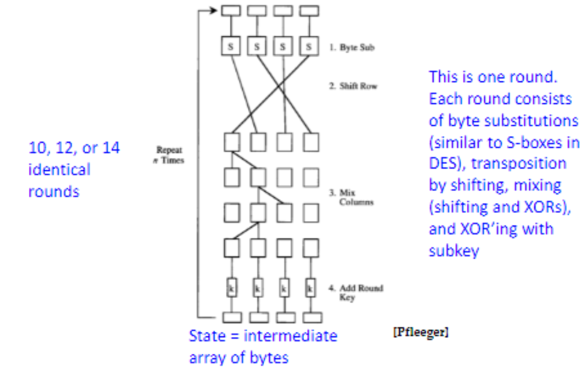

10/1/2024

# Private Key Cryptography - Part II

## Meet in the middle attacks
The reason double DES does not work 

Steps
1. Given P, Try all possible K_1 keys and stare results for X
2. Given C try all possible K_2 keys and match results with previoiusly calculated X's 

[[image from slides]]

## TDES
triple DES

DES is to weak since its only a 56 bit key 

It is slow as a result from the extra encryption

offers only 2x56 = 112 bit key security 

          K1          K2          K3
          |           |           |
    P -> [E] -> A -> [D] -> B -> [E] -> C 

## Cipher modes 
### Electronic codebook: 
Used in simplest way, DES enciphers 64 bit plaintext blocks to 64 bit ciphertext Blocks. each block independently done with the same key 
- best used with a single value or short data messages 
- vulnerable due to the repeated use of the ciphertext making it easier to determine by the crypto-analyst

### Cipher Block Chaining:
The input to the encryption algorithm is the XOR of the next 64 bits of plaintext and the preceding 64 bits of ciphertext.
- Done in reverse for dencryption 
- prevent repitition in plaintext making it difficult for the analyst to determine the ciphertext 
- good for large data messages 

### Cipher Feedback:

s-bit Cipher Feedback mode 

Uses a s bit to shift the ciphertext and encrypt using that s bit shifted value 
- commonly s = 8 
- good for real time encryption 

### Output Feedback 
similar to cipher feedback mode, but with the method of the Cipher Block chaining using the resulting value as the shift value of the next encryption step 
- good for noisy transmission and error prone data 

### Counter 
Encrypt a counter for a plain text portion and then increment the counter meaning the ecryption will change at every step 

- inverse is done for decryption 
- much faster due to the encryption being able to be done in parallel since there is no need for chaining.  
- you can pre-emptively create the ecrypt for the data

## AES 

Advanced Encryption Standard

Privatekey symmetric block sipher 

128-bit data

Rijndael(rine doll) selecte for AES in 2001 

uses rounds of substitution, trransposition, shifts, and XOR 

|key size|rounds|
|----|----|
|128|10|
|192|12|
|156|14|

### General Structure 

### Byte Substitution 

A simple substitution of each byte using a table of 16x16 bytes containing a permutation of each 256 8-bit values 

