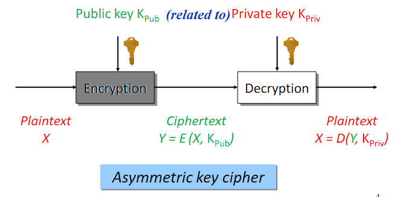
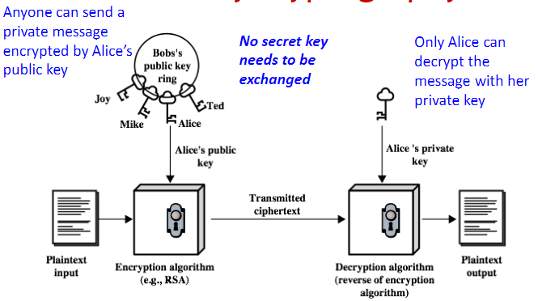
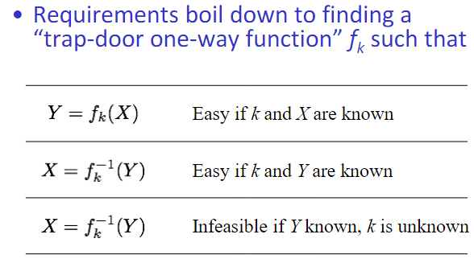
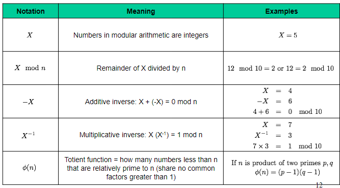
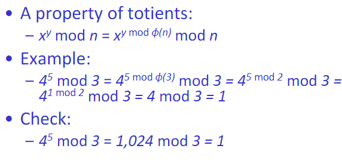
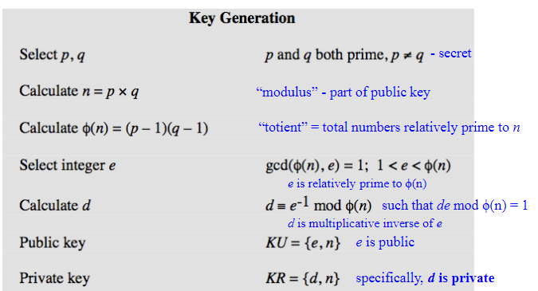
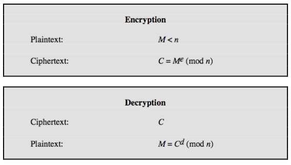

10/8/2024

# Public Key Encryption

assymetric 

### Public Key Ciphers

### Public Key Cryptography
The concept of a two key cipher
is one of the truly brilliant ideas
in Diffie and Hellman’s
revolutionary 1976 paper, “New
Directions in Cryptography”

**Idea:** using the hard mathematical
problems to define the relationship
between public and private keys!

Three classes of hard mathematical
problems have been explored for PKC
1. Integer Factorization
2. Discrete Logarithm
   - In a Finite Field
   - On an Elliptic Curve
3. Lattice Closest Vector

### Requirements 

1976 Diffie-Hellman described concepts
and requirements:
- Easy to generate a public/private key pair
- Easy to do encryption with public key
- Easy to do decryption with private key
- Although mathematically related, infeasible to
discover private key from knowing public key
- Infeasible to discover plaintext from knowing
public key and ciphertext

## RSA
977 RSA (Rivest-Shamir-Adleman at MIT)
developed first practical public key
cryptosystem, published 1978, patented
by MIT in 1983
- Key length is variable (typically 512 bits)
- Block size is variable
- Plaintext must be shorter than key length
- Ciphertext will be key length

### Modular Arithmetic

### Key Generation

## How PKC Can Be Used 

## WWH of public key management

