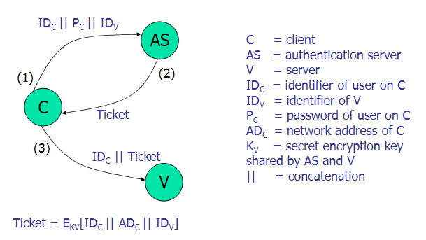
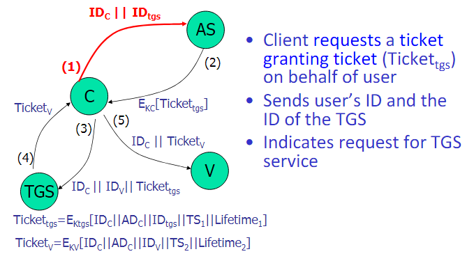

10/17/2024

# Kerberos & X.509 Authentication 

both are used in entity verification 

## Kerberos
provides a centralized authentication server 
- authenticate users to servers and servers to users (Mutual Auth)

Relies exclusively on conventional encryption

### Requirements
- Secure - no masquerading 
- Reliable - distributed system architecture
- Transparent - User unaware of clients and servers 
- Scalable - Support large number of servers and clients 

### Authentication example
Risk: Impersonation

each server needs to confirm identity of each client 

Use of an authentication server (AS)
- Knows password of all users (database)
- Shares a secret key with each server that needs to authenticate clients

### Problems 
1. the nubmer of times that a user has to enter the password
2. The Password is communicated in plain text

### Ticket Granting Service (TGS)
issues tickets to users who have been authenticated to the AS

user first requests a ticket granting ticket from the AS

a client requesting services applies to the TGS using the ticket to authenticate itself

- Prevents the need of sending the password multiple times in plain text 

#### Problems
- Lifetime associated with the ticket granting ticket 
  - if too short then repeated password prompting
  - Too long and it is vulnerable to capture
- These Problems are addressed in Kerberos version 4

### Version 4
Session key - this is included in the encrypted message 
- used to authenticate TGS and V respectively

 

### Realms 

A realm is a collection of clients and servers under 

### Version 5 
- Specified RFX 1510
- does not depend on DES 
- Arbitrary ticket lifetime
- Authentication forwarding 
- Inter-realm authentication 

## X.509 
Defines the standards for digital certificates 

based on public key cryptography and digital signatures

defines a framework for the provision  of authentication services 

Repository of public key certificates

- Used in S/MIME, IPsec, SSL, SET

### Certificates 

### Authentication services