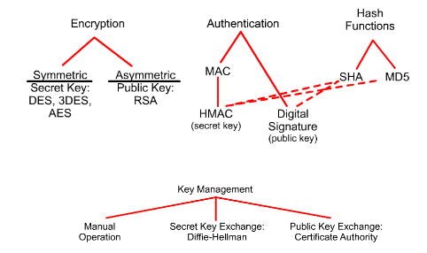
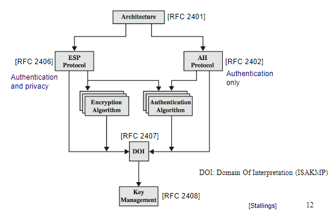
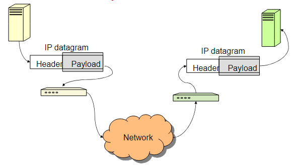
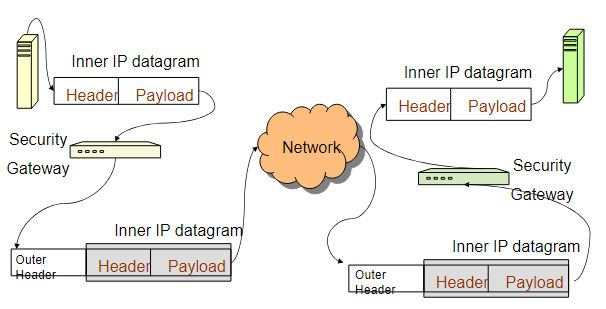
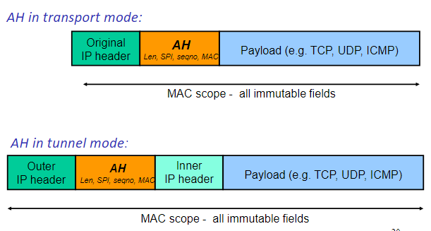
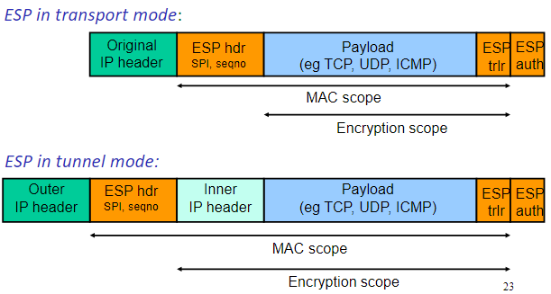

10/25/2024

# Secure Channel Concept and IPsec 

## Secure Channel

*Goal:* protecting information exchanged over insecure networks
- for confidentiality, integrity, and authentication 

*Idea:* What if we have a secure channel so that information can be securely exchanged between two ends of the channel

### Building a Secure Channel 

Authenticated key establishment (AKE) phase 
- Entity authentication and shared secret agreement 
  
A key derivation phase 
- MAC & encryption keys are derived from chared secret - **session keys**

Traffic protection phase 
- Data Integrity, origin authentication and confidentiality services provided by using security mechanisms and session keys

### Used Crypto Channels 
- Asymmetric encryption, signature algorithms, Diffie-Hellman
  - entity auth and key establishment 
- Symmetric encryption algorithms 
  - speedy confidentiality protection for traffic 
- Keyed-hashed MAC algorithms 
  - fast data origin authentication and integrity protection 
- keyed pseudo-random functions 
  - key deviation 

### Other Primitives 

- Sequence numbers
  -  Widely used to prevent replay attacks
  -  Protected by MAC mechanisms
- Nonces and timestamps
  - Often used to provide freshness
  - Used in entity authentication exchanges to protect against replay attacks

### Location of Secure Channel 

Security can be applied at any of the network layers except physical layer 
- physical layer security is rarely possible 

#### Pros and Cons of each Layer 

Data Link (Network Interface) layer
- Pro: No changes to higher layers
- Con: protection only for one ‘hop’

Network (Internet) layer
- Pro: Covers all traffic, end-to-end
- Pro: Transparent to transport and applications
- Con: Little application control
  - application has no visibility of Internet layer
- Con: Unnatural, since network layer is stateless and unreliable
  - order of data in secure channel may be crucial
  - difficult to maintain if IP datagrams are dropped, re-ordered,…

Transport layer
- Pro: End-to-end
- Pro: Applications can control when it’s used
  - application has greater visibility of transport layer
- Pro: Transport layer may be naturally stateful (TCP)
- Con: Applications must be modified (unless proxied)

Application layer
- Pro: Security can be tuned to payload requirements
  - different applications may have radically different needs.
- Con: Every application must handle own security

## IPSec 

Provides security at the network layer 
- all IP datagrams protected 
- No re-engineering of applications
- Transparent to users 

Optional for IPv4 but mandatory for IPv6 

Defined in IETF RFC's 2401-2412

### Specifications 

### Basic Features 

IPSec provides two basic modes of use 
- **Transport Mode**, for IPSec-aware hosts 
- **Tunnel Mode**, for IPSec-unaware hosts 

provides authentication and confidentiality services for data

IPSec provides a flexible set of key establishment methods 

### IPSec Transport Mode 

Protection for upper-layer protocols

Protection covers IP datagram payload and
selected header fields
- Datagram payload: TCP or UDP packets, ICMP message, etc…

Host-to-host (end-to-end) security
- IPSec processing performed at endpoints of secure channel
- Thus *endpoint hosts must be IPSec-aware*

### IPSec Tunnel Mode 

Protection for entire IP datagram
- Entire datagram plus security fields treated as new payload of ‘outer’ IP datagram
- Original ‘inner’ IP datagram encapsulated within ‘outer’ IP datagram

IPSec done at security gateways on behalf of endpoint hosts - hosts need not be IPSec-aware
- Gateway-to-gateway rather than end-to-end security

Intermediate routers have no visibility of inner IP datagram
- Even orginal source and destination addresses encapsulated and so ‘hidden’

### AH and ESP 

Supported Algorithms 

ESP
- DES
- RC5
- IDEA

AH 
- HMAC-MD5-96
- HMAC-SHA-1-96

### Security Policy 
How does IPSec determine what security processing is to be applied to IP datagrams?
- IPSec-aware host has a **Security Policy Database (SPD)**
- SPD is queried for each outbound and inbound datagram

Fields in IP datagram compared to fields in SPD entries to find matches
- based on a set of criteria, e.g. addresses, protocols, etc…

A match identifies a **Security Association (SA)** or group of SAs, no match means the need for new SA
- Each SA is a set of algorithms, mode (tunnel or transport) and keys to be used to process a datagram

### Security Associations 

An SA is a one-way relationship between sender and receiver
- Specifies cryptographic processing to be applied to this datagram from this sender to this receiver
- is held in a **SA database (SADB)**

Each SA is identified by unique SPI (32 bit value carried in AH and ESP headers)
- Allows recipient to determine how to process received datagrams

Information in SA includes
- Sequence number counter and anti-replay window
- AH/ESP info: algorithms, IVs, keys, key lifetimes
- SA lifetime
- Protocol mode: tunnel or transport

### Key Management

PSec uses a lot of symmetric keys
- One key for each SA
- Different SAs for many scenarios
  - {ESP,AH} x {tunnel, transport} x {sender, receiver}
- Many keys are required!

How to provide IPSec keys in SAs?

Manual keying
- May work for small number of nodes, but unmanageable for large number of IPSec-aware hosts
- Requires manual re-keying

IKE: Internet Key Exchange, RFC 2409
- IKE is a specific adaptation of more general protocols (“Oakley” and “ISAKMP")

#### IKE Phases 

Phase 1: Set up an SA and secure channel to carry further SA negotiation 

Phase 2: SA's for general use are negotiated 

## AH Protocol

AH = Authentication Header (RFC 2402)

Provides data origin authentication and integrity

AH authenticates whole payload and most of header

Prevents IP address spoofing
- Source IP address is authenticated

Creates stateful channel
- Use of sequence numbers

Prevents replay of old datagrams
- AH sequence number is authenticated

Uses MAC and secret key shared between endpoints

### Header Information 

AH specifies a header added to IP datagrams

Fields in header include
- Payload length
- SPI (Security Parameters Index)
  - Identifies which algorithms and keys are to be used for IPSec processing (more later)
  
- Sequence number
- Authentication data (the MAC value)
  - Calculate over immutable IP header fields (so omit TTL) and (payload or inner IP datagram)

### Transport and Tunnel Modes 

## ESP Protocol 

ESP - Encapsulating Security Payload (RFC 2406)

Provides one or both of:
- confidentiality for payload
  - sequence number not protected by encryption
- authentication of payload
  - but not of any header fields (original header or outer header)

Traffic-flow confidentiality in tunnel mode

Uses symmetric encryption and MACs based on secret keys shared between endpoints

Separate authentication in AH and in ESP due to both engineering and political reasons

### Header and Trailer 

ESP specifies a header and trailing fields to be added to IP datagrams

Fields in header include:
- SPI
- Sequence number

Fields in trailer include:
- Any padding needed for encryption algorithm (may also help disguise payload length)
- Padding length
- Authentication data (if any) – the MAC value

### Transport and Tunnel Mode 

